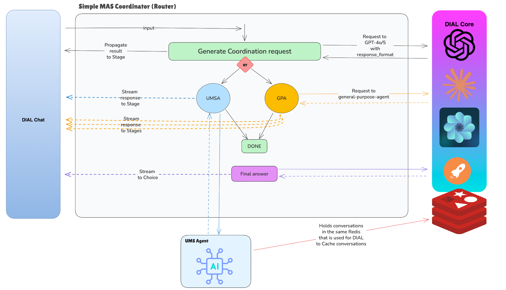

# MAS (Multi Agent System) Coordinator to Work with General-purpose and Users Management Agents

**This is the simplest version of MAS Coordinator that works as a *router* between GPA and UMS Agents**



---

### Task 1: Preparation of docker compose with all the services:
<details>
<summary>Task 1</summary>

Prepare [docker-compose](docker-compose.yml) with all the services:
1. Add `redis-insight` service to check later that conversations from UMSA and cached from DIAL are there
    ```yaml
      redis-insight:
        image: redislabs/redisinsight:latest
        depends_on:
          - redis
        ports:
          - "6380:5540"
    ```
   How to connect (do it when all the services are configured and you run docker-compose):
    - Open http://localhost:6380
    - Add connection to `redis`, pay attention that both of them are running in Docker environment and you should connect not through localhost, but through service name `redis`
2. Add `userservice`:
    ```yaml
      userservice:
        image: khshanovskyi/mockuserservice:latest
        ports:
          - "8040:8000"
        environment:
          - PYTHONUNBUFFERED=1
          - GENERATE_USERS=true
          - USER_COUNT=1000
        volumes:
          - ./data:/app/data
    ```
3. Add `ums-mcp-server`:
    ```yaml
      ums-mcp-server:
        depends_on:
          - redis
          - userservice
        image: khshanovskyi/ums-mcp-server:latest
        ports:
          - "8041:8005"
        environment:
          - USERS_MANAGEMENT_SERVICE_URL=${USERS_MANAGEMENT_SERVICE_URL:-http://userservice:8000}
        volumes:
          - ./data:/app/data
    ```
4. Add `ums-agent` (it is the same [UMS Agent](https://github.com/khshanovskyi/ai-general-ui-ums-agent/tree/completed) that we have implemented earlier):
    ```yaml
      ums-agent:
        depends_on:
          - redis
          - ums-mcp-server
        image: khshanovskyi/general-ums-agent:latest
        ports:
          - "8042:8000"
        environment:
          - UMS_MCP_URL=http://ums-mcp-server:8005/mcp
          - OPENAI_API_KEY=${OPENAI_API_KEY}
          - ORCHESTRATION_MODEL=gpt-4o
          - REDIS_HOST=redis
          - REDIS_PORT=6379
        volumes:
          - ./data:/app/data
          - /var/run/docker.sock:/var/run/docker.sock
    ```
    **Pay attention that you need to set up OPENAI_API_KEY as env variable on your machine, or insert is instead of ${OPENAI_API_KEY}**
5. Add `python-interpreter-mcp-server`:
    ```yaml
      python-interpreter-mcp-server:
        image: khshanovskyi/python-code-interpreter-mcp-server:latest
        ports:
          - "8050:8000"
        environment:
          LOG_LEVEL: "INFO"
        restart: unless-stopped
        mem_limit: 2G
        cpus: 2.0
    ```
6. Add `ddg-search-mcp-server`:
    ```yaml
      ddg-search-mcp-server:
        image: khshanovskyi/ddg-mcp-server:latest
        ports:
          - "8051:8000"
        environment:
          LOG_LEVEL: "INFO"
          MCP_TRANSPORT: "streamable-http"
        restart: unless-stopped
        mem_limit: 512M
        cpus: 0.5
    ```
7. Add `general-purpose-agen` (it is the same [GPA](https://github.com/khshanovskyi/ai-general-general-purpose-agent/tree/completed) that we have implemented earlier):
    ```yaml
      general-purpose-agent:
        depends_on:
          - redis
          - python-interpreter-mcp-server
          - ddg-search-mcp-server
        image: khshanovskyi/general-purpose-agent:latest
        ports:
          - "8052:5000"
        environment:
          - OPENAI_API_KEY=${OPENAI_API_KEY}
          - DEPLOYMENT_NAME=gpt-4o
          - DIAL_ENDPOINT=http://core:8080
          - PYINTERPRETER_MCP_URL=http://python-interpreter-mcp-server:8000/mcp
          - DDG_MCP_URL=http://ddg-search-mcp-server:8000/mcp
        volumes:
          - ./data:/app/data
    ```
    **Pay attention that you need to set up OPENAI_API_KEY as env variable on your machine, or insert is instead of ${OPENAI_API_KEY}**
8. Run [docker-compose](docker-compose.yml) and test that it works:
   - Make POST request to http://localhost:8052/openai/deployments/general-purpose-agent/chat/completions `{"messages": [{"role": "user","content": "hi?"}]}` 
   - Create new conversation to UMS

</details>

---

### Task 2: Configure DIAL Core:
<details>
<summary>Task 2</summary>

1. Add GPT and DALL-E models:
    ```json
    {
      "gpt-4o": {
        "displayName": "GPT 4o",
        "endpoint": "http://adapter-dial-openai:5000/openai/deployments/gpt-4o/chat/completions",
        "iconUrl": "http://localhost:3001/gpt4.svg",
        "type": "chat",
        "upstreams": [
          {
            "endpoint": "https://api.openai.com/v1/chat/completions",
            "key": "${OPENAI_API_KEY}"
          }
        ]
      },
      "dall-e-3": {
        "displayName": "DALL-E",
        "endpoint": "http://adapter-dial-openai:5000/openai/deployments/dall-e-3/chat/completions",
        "iconUrl": "http://localhost:3001/gpt3.svg",
        "type": "chat",
        "upstreams": [
          {
            "endpoint": "https://api.openai.com/v1/images/generations",
            "key": "${OPENAI_API_KEY}"
          }
        ]
      }
    }
    ```
2. Add `general-purpose-agent` to applications:
    ```json
    {
      "general-purpose-agent": {
        "displayName": "General Purpose Agent",
        "description": "General Purpose Agent. Equipped with: WEB search (DuckDuckGo via MCP), RAG search (supports PDF, TXT, CSV files), Python Code Interpreter (via MCP), Image Generation (model).",
        "endpoint": "http://host.docker.internal:8052/openai/deployments/general-purpose-agent/chat/completions",
        "inputAttachmentTypes": ["image/png", "image/jpeg", "application/pdf", "text/html", "text/plain", "text/csv"],
        "forwardAuthToken": true
      }
    }
    ```
3. Restart `core` service in Docker and check if models are available to use as well as GPA and test that they are woking

</details>

---

### Task 3: Create Simple MAS Coordinator with routing to UMS Agent:
<details>
<summary>Task 3</summary>

1. Add `mas-coordinator` to applications:
    ```json
    {
      "general-purpose-agent": {
        "displayName": "MAS Coordinator Agent",
        "description": "MAS Coordinator Agent that coordinates user requests to General-purpose Agent or UMS Agent",
        "endpoint": "http://host.docker.internal:8055/openai/deployments/mas-coordinator/chat/completions",
        "inputAttachmentTypes": ["image/png", "image/jpeg", "application/pdf", "text/html", "text/plain", "text/csv"],
        "forwardAuthToken": true
      }
    }
    ```
2. Provide implementation for the [app.py](task/app.py) according to TODO
3. Provide implementation for the [agent.py](task/agent.py) according to TODO
4. Provide implementation for the [prompts.py](task/prompts.py) according to TODO
5. Provide implementation for the [ums_agent.py](task/coordination/ums_agent.py) according to TODO
6. Run application and test it:
   - `Do we have Andrej Karpathy as a user?`
   - Add Andrej Karpathy as use to our system
   - Expected results after the testing: 
     - Coordinator makes proper route to UMS Agent
     - Message history is preserved
     - Final result is generated based on the UMS Agent response

</details>

---

### Task 4: Add GPA with supported all DIAL features:
<details>
<summary>Task 4</summary>

**You can propagate Stages, Attachments and State to our App**
1. Provide implementation for the [gpa.py](task/coordination/gpa.py) according to TODO
2. Run application and test it:
   - Search the weather in Kyiv and after that generate a picture of it
   - Provide the [report.csv](tests/report.csv) and ask to generate chart bar from it
   - Expected results: 
     - Stages propagated from GPA to MAS Coordinator as well as attachments

</details>

---
